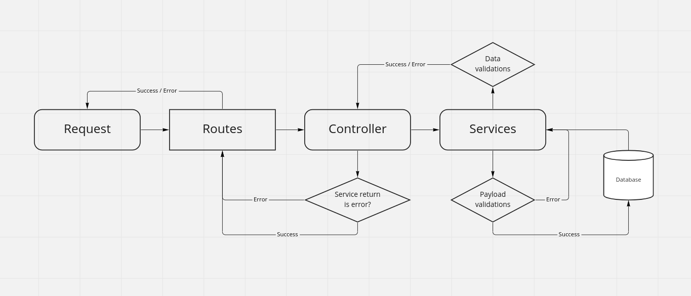
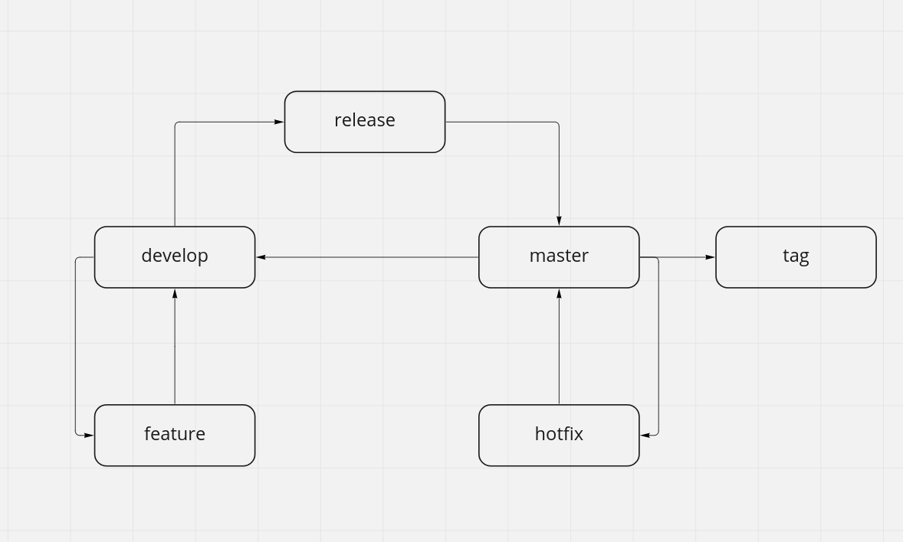

# Student Management back
This application has developed with NodeJs, TypeScript, Express and TypeORM.

## Scrypt commands
* `yarn start:dev` or `npm run start:dev`
* `yarn start` or `npm run start`

## For use on local development
* Use 'start:dev' command for serve it, and watch files in development mode.

## For use on production
* Use 'start' command for run this or use 'docker-compose up' for expose it in a docker container.

## Used pattern
In this project I used an abstract MVC in a layer pattern, separating these layers into folders as you can see below.

## Path structures
### How to use paths
* controllers
    * For create modules controllers
* docs
    * For create modules swagger docs
* entities
    * For create modules entities
* middlewares
    * For implement routes middlewares
* routes
    * For implement app routes and modules routes
* services
    * For implement modules services
* utils
    * For develop development helpers

### All application paths
* controllers
* docs
    * auth
    * student
* entities
* middlewares
* routes
* services
* utils

## Dependences
* body-parser
  * For do parser on requests
* cors
  * For use cors in application
* crypto
  * For implement cryptography in application
* dotenv
  * For use environment variables
* express
  * For use express framework
* express-handler-errors
  * For create custom errors
* jsonwebtoken
  * For use jwt for authentication
* pg
  * For use postgres
* reflect-metadata
  * For reflect metadata typeorm and postgres
* swagger-ui-express
  * For use swagger with express to make a API documentation
* ts-node
  * For run TS code in node
* typeorm
  * For facility use sql
* typescript
  * Use this for use types and more
* uuid
  * For generate UUID

## Dev dependences
* @types/config
  * For use config with TS
* @types/express
  * For use node with TS
* @types/node
  * For use uuid with TS
* @types/uuid
  * For use uuid with TS
* @types/cors
  * For use cors with TS
* @types/jsonwebtoken
  * For use jwt with TS
* @types/swagger-ui-express
  * For use swagger ui express with TS
* eslint
  * For lint code
* nodemon
  * For restart server in dev mode
* prettier
  * For code format

## Proposed improvements
* Implement yup for payload validations
* Implement integrations tests
* Implement build with bundle for best perform on production mode

## Layers process

  

## Proposed gitflow

  

